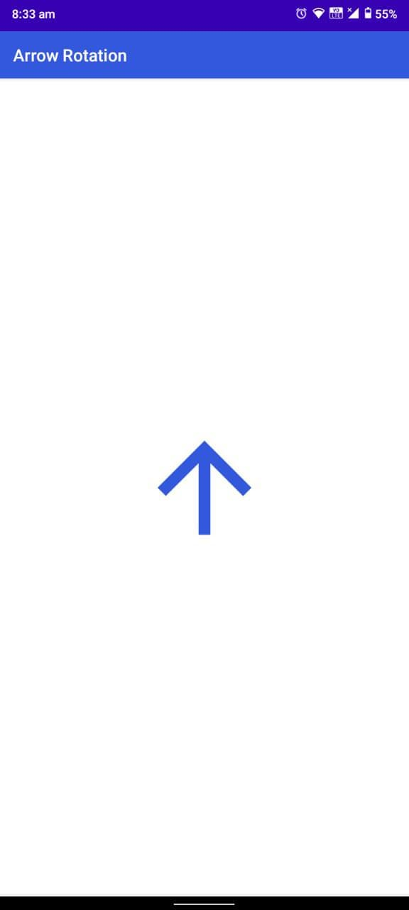
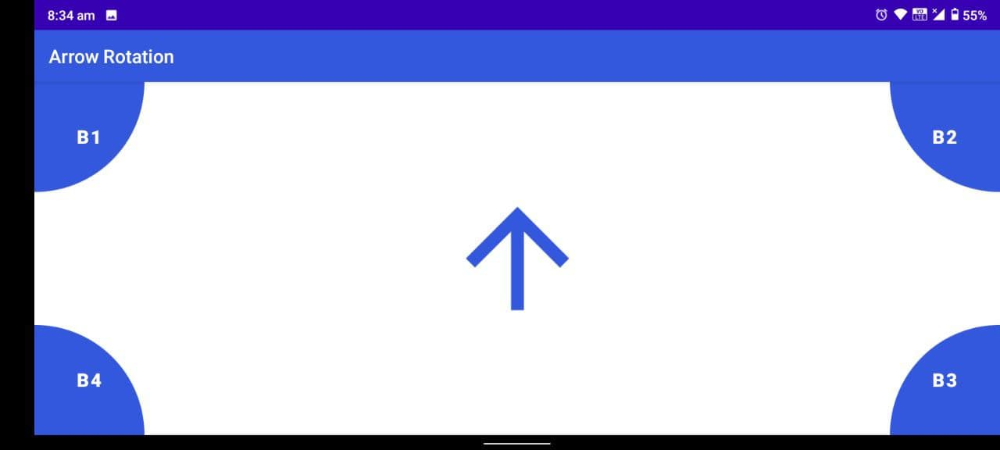
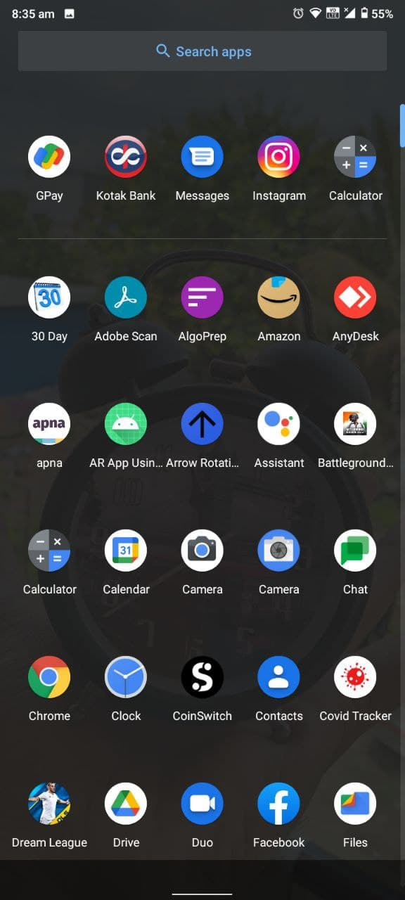

# Arrow-Rotation-Application
## Description
* In this app we create one arrow rotate in Clockwise direction.
* When the screen is vertical then the arrow should point towards the
sky. When the screen is horizontal then this B1, B2,B3 and B4 button
is Visible and the arrow should keep rotating in a clockwise direction.
* When we Tap on button arrow is stop towards the button direction
when we double on and long pressed on button then arrow is stop at
opposite its direction.
* Tech Stack :- Android Studio, XML &Java.

## Screenshots
### Vertical Screen

### Horizontal Screen

### Tap on B1 

### Double tap on B1

### Tap on B2 

### Double tap on B2

### App icon 

### Project Explanation

https://user-images.githubusercontent.com/70057381/124415894-6d51ff80-dd73-11eb-9e40-3ef3698e30d1.mp4

